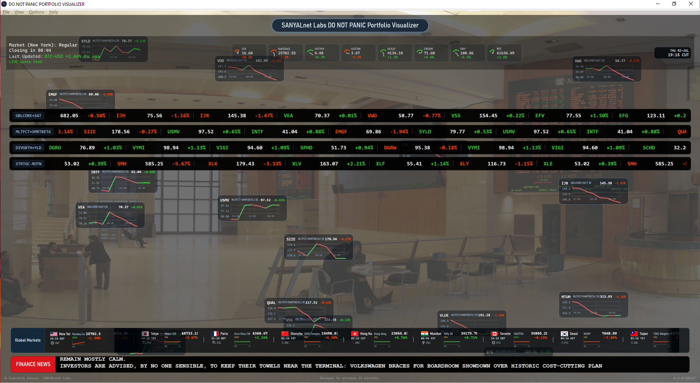

<!--
============================================================================
Copyright (c) 2026 Supratim Sanyal of SANYALnet Labs.
Proprietary rights reserved except as expressly licensed herein.

DO NOT PANIC PORTFOLIO VISUALIZER
This file is governed by the SANYALnet Labs Non-Commercial License in the
root LICENSE file. Non-Commercial use is permitted; Commercial Use and use
for AI/ML model training are prohibited unless separately authorized.

Attribution is required: "Based on original work by Supratim Sanyal of
SANYALnet Labs." See LICENSE for full terms, warranty disclaimer, termination,
patent, trademark, and governing-law provisions.
============================================================================
-->

# DO NOT PANIC PORTFOLIO VISUALIZER 1.0

## [Download the latest Windows release](https://github.com/tuklusan/DO-NOT-PANIC-PORTFOLIO-VISUALIZER/releases/latest)

**Windows SmartScreen notice:** Version 1.0 is an unsigned, independently
published Windows application. If you downloaded the installer from this
official GitHub repository or the official
[itch.io page](https://tuklusan.itch.io/do-not-panic-portfolio-viewer), and its
SHA-256 checksum matches the published checksum, choose **More info** and then
**Run anyway** when Windows displays "Windows protected your PC." The complete
source code is publicly available here for inspection, and every official 1.0
download set includes its checksum and a VirusTotal advisory report. VirusTotal
is an independent multi-engine scan, not a certification, warranty, or
guarantee of safety.

**DO NOT PANIC PORTFOLIO VISUALIZER** is a cinematic, fullscreen stock market
dashboard for Windows 10 and Windows 11. It turns delayed market data, custom
portfolio ticker tapes, floating stock charts, global market information,
financial news, and city or stock-exchange photography into an ambient finance
display designed for a desktop, office monitor, television, or dedicated
market-information screen.

### [Watch the video demonstration](https://youtu.be/sEtRox-geWM)

## A Stock Market Dashboard Designed to Be Seen

Many portfolio applications are dense grids of controls. DO NOT PANIC takes a
different approach: it is a visual market display that can remain open while
you work, read, relax, or watch the trading day unfold. The scene fills itself
progressively, updating one market symbol at a time so the display remains
alive without repainting the whole interface.

Use it as a:

- fullscreen stock ticker display for a second monitor or wall-mounted screen
- customizable ETF and equity portfolio visualizer
- ambient financial markets dashboard for Windows
- global stock market and macro-market display
- floating stock-chart and finance-news visualization
- screensaver-style market display without legacy screensaver integration

This application is for visualization, education, and entertainment. Market
data is delayed by at least 15 minutes. It is **not** a trading terminal,
financial-planning application, portfolio-accounting system, alerting service,
or dependable financial monitoring tool. Never use it to make trading,
investment, tax, valuation, or financial-planning decisions.

## Visual Features

### Four customizable portfolio ticker tapes

Build up to four independent ticker lanes with the stocks, ETFs, indexes, or
other supported symbols you want to see. Each lane can move in its own
direction and at its own speed. A fresh quote produces a brief color signal:
blue when the displayed value is unchanged, green when it rises, and red when
it falls.

### Floating graph cards for the biggest movers

The scene selects up to 16 of the largest movers and represents them as compact
floating graph cards. Current-session charts use time labels, while off-hours
fallback charts use recent market-day labels. When a fresh raw price rises, the
corresponding card flashes green and moves quickly toward the ceiling; when it
falls, it flashes red and moves toward the floor. At the edge, it stops
flashing and resumes its normal drifting motion.

### Macro-market ribbon

The upper market ribbon fills one symbol at a time with a broad view of market
conditions, including volatility, major US indexes, Treasury yields, gold,
crude oil, the US dollar index, and Bitcoin. The upper-left panel also shows
New York market status and the most recently updated symbol.

### World markets and local conditions

The Global Markets ribbon presents major financial centers around the world
with local exchange time, index direction, session state, and available local
weather. It operates independently so slow world-market or weather data does
not block the rest of the visualization.

### Financial news scroller

The bottom ribbon reveals financial headlines character by character, wraps
them across two lines, pauses for reading, and then advances to the next item.
The default RSS mode requires no AI account. Optional AI-summarized news can
present current financial stories in Douglas Adams-inspired Vogon haiku or
classical Shakespearean style.

### Rotating financial and city backgrounds

The app includes three built-in high-resolution backgrounds and can download a
curated set of public financial-center and skyline images. Backgrounds rotate
with a slow zoom effect. You can instead select your own image folder,
including subfolders, and use the visualizer as a personalized market backdrop.

## Window and Fullscreen Controls

- Press **F11** to enter or leave fullscreen mode.
- Double-click anywhere in the visualization to toggle fullscreen.
- Press **Esc** to leave fullscreen.
- Maximize the normal window when you want Windows menus and taskbar behavior.
- Fullscreen uses the current monitor and removes the normal menu area.

## Installation

1. Open the [latest GitHub Release](https://github.com/tuklusan/DO-NOT-PANIC-PORTFOLIO-VISUALIZER/releases/latest).
2. Download `DoNotPanicPortfolioVisualizerSetup-1.0.exe`, its SHA-256 file, and
   the VirusTotal advisory report.
3. Verify the installer checksum if you are comfortable using a checksum tool.
4. Run the installer. If SmartScreen appears, confirm that the file came from
   this official project, choose **More info**, and select **Run anyway**.
5. Read and accept the SANYALnet Labs Non-Commercial License.
6. Launch the app from the Desktop or Start menu shortcut.

The installer performs an all-users installation under Program Files and adds
standard Desktop and Start menu shortcuts. The uninstaller removes the
application and its app-owned Local AppData, but does not delete an external
image folder selected by the user.

## Configuration

Open **Options > Configure** to customize:

- portfolio tape names, symbols, directions, and speeds
- background rotation interval and custom image folder
- RSS or AI-summarized financial news
- news writing style and refresh interval
- OpenAI-compatible AI API key, endpoint URL, and model ID

Validation checks ticker symbols and, when AI news is selected, verifies the
configured AI access before applying settings. Successful changes take effect
when you select **OK**. **Cancel** closes the configuration window without
applying the proposed changes.

## Optional AI Financial News

RSS financial news is selected by default and works without an API key. For
optional AI summaries, the shipped configuration is ready for OpenRouter:

- Endpoint: `https://openrouter.ai/api/v1`
- Model: `openrouter/free`
- API key: empty until supplied by the user

To obtain a free personal key, visit [OpenRouter](https://openrouter.ai/),
create an individual account, create an API key, and enter it under
**Options > Configure > Advanced**. The app can discover a suitable free
instruct/chat model at runtime. Other OpenAI-compatible providers can be used
by changing the endpoint, model ID, and key.

Free-provider quotas and model availability can change. The app uses a minimum
30-minute AI-news refresh interval and falls back to RSS when AI access is
unavailable. API keys entered in the application are stored in the protected
local application-data area and are not read from environment variables.

## Market Data, Network Use, and Local Storage

- Market quotes and chart history are retrieved through the bundled
  YFinance.NET service.
- Quote requests are paced one symbol at a time, approximately once per second,
  while responses are processed asynchronously.
- Market data may be incomplete, delayed, unavailable, revised, or inaccurate.
- Settings, protected provider secrets, news cache, chart cache, traces, and
  downloaded backgrounds are stored under
  `%LOCALAPPDATA%\DoNotPanicPortfolioVisualizer`.
- The application uses network access for market data, RSS news, optional AI
  news, world-market weather, and managed background downloads.
- Degraded and offline states are designed to preserve the visible scene where
  possible and communicate when fresh data is unavailable.

## System Requirements

- Windows 10 or Windows 11, 64-bit
- Internet access for fresh market data and news
- A display resolution suitable for the dashboard; fullscreen and maximized
  layouts scale across standard laptop, desktop, and ultrawide screens
- Optional OpenAI-compatible API key only if AI-summarized news is enabled

The public installer is self-contained; end users do not need Visual Studio or
the .NET SDK.

## Trust and Release Verification

The GitHub Release is the canonical source for versioned binaries. The itch.io
page is a convenience mirror populated only after the GitHub installer,
SHA-256 checksum, and VirusTotal advisory report are complete.

For each official 1.0 release:

- the source revision is published in this repository
- the installer has a published SHA-256 checksum
- a VirusTotal URL analysis is requested after GitHub publication
- the resulting advisory report is attached to the release and mirrored to
  itch.io

Unsigned software has no verified Authenticode publisher identity, and
SmartScreen reputation starts over for each unsigned build. The VirusTotal
report and public source improve transparency, but they do not replace your own
judgment or endpoint security.

## License and Attribution

Copyright (c) 2026 Supratim Sanyal of SANYALnet Labs. This software is
source-available under the [SANYALnet Labs Non-Commercial License](LICENSE) for
strictly non-commercial personal, educational, and hobbyist use. Commercial
use, corporate internal use, monetization, and AI model training are
prohibited. This is not a public-domain or OSI open-source release.

Third-party notices and the Apache 2.0 license applicable to the YFinance.NET /
yfinance lineage are included in [THIRD-PARTY-NOTICES.md](THIRD-PARTY-NOTICES.md)
and [THIRD-PARTY-LICENSES](THIRD-PARTY-LICENSES).

## Source, Support, and Technical Documentation

The source is published so users can inspect how the visualizer works and so
non-commercial developers can study or improve it under the license terms.

- [Report a problem or request a feature](https://github.com/tuklusan/DO-NOT-PANIC-PORTFOLIO-VISUALIZER/issues)
- [Build and deployment guide](BUILD_AND_DEPLOY.md)
- [Public release workflow](docs/RELEASES.md)
- [YFinance.NET protocol documentation](docs/YFINANCE_NET_ICD.md)

Developed by **Supratim Sanyal** of **SANYALnet Labs**.
